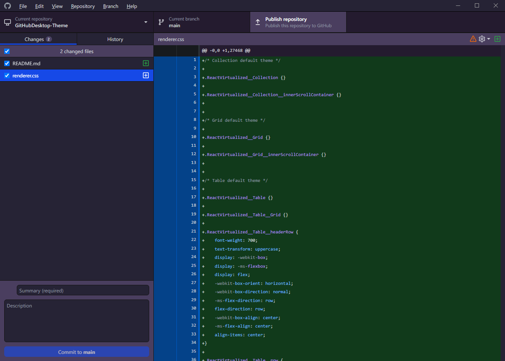

# Github Desktop Application Theme

_A Theme for Github Desktop application._

This version is only tested in `2.9.10` version of Github Desktop.

It modifies `body.theme-dark` in `renderer.css` file under `GitHubDesktop\app-X.Y.Z\resources\app`.

This will modify your dark theme.

## Installation

1. Clone this repository.
    > Or just copy `renderer.css` file.

2. Go to Github Desktop Application's resources\app directory.
    
    > In Windows, for version `2.9.10` it is under,
    `C:\Users\<Username>\AppData\Local\GitHubDesktop\app-2.9.10\resources\app`
    > 
    > If there are multiple versions installed, pick the latest one or the one you want to use.
    
3. Create a backup of the original `renderer.css` file.
    > If things go wrong, you can recover using the original `renderer.css` file.

4. Copy `renderer.css` file from this repository and replace it with the default one.

5. Enjoy!

## Screenshots

